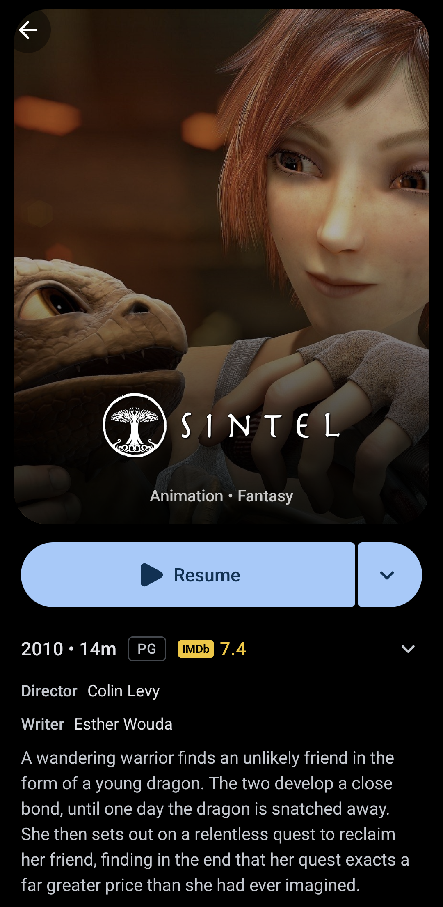
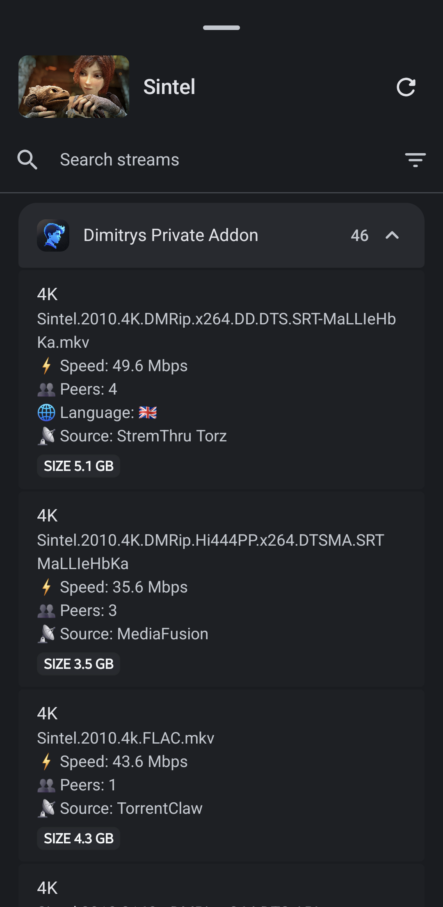
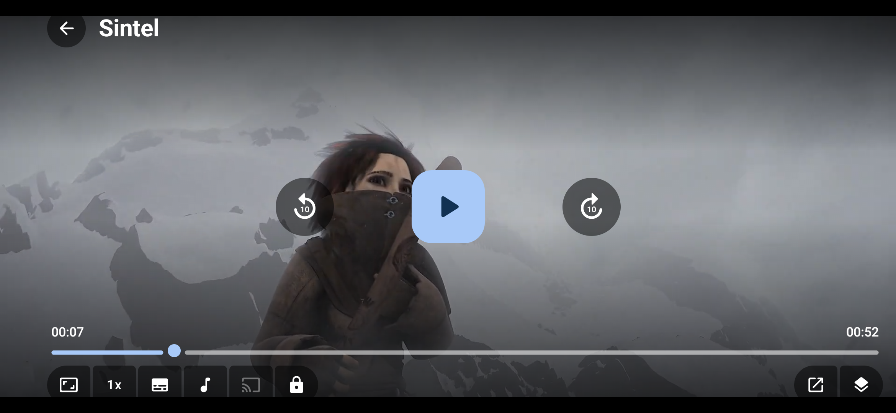

<div align="center">

  <h1>Provenio</h1>

  <p>
    A free, open-source media app for your phone, your desktop, and the TV you already own.
    <br />
    Bring your own sources. Provenio turns them into a library with artwork, ratings, subtitles, and your place saved on every screen.
  </p>

  [GitHub releases](https://github.com/Dimitrysaf/provenio/releases/latest)

</div>

<p align="center">
  
  
</p>
<p align="center">
  
</p>

## Get Provenio

- [Android APK, Windows MSI and Linux Flatpak](https://github.com/Dimitrysaf/provenio/releases/latest)

## Build from source

```bash
git clone --recurse-submodules https://github.com/Dimitrysaf/provenio.git
cd provenio
```

### Android

Android development requires Android Studio and the Android SDK.

```bash
./gradlew :androidApp:assembleFullDebug
```

### iOS

iOS development requires macOS and Xcode.

```bash
env PROVENIO_IOS_DISTRIBUTION=full xcodebuild \
  -project iosApp/iosApp.xcodeproj \
  -scheme iosApp \
  -configuration Debug \
  -sdk iphonesimulator \
  -derivedDataPath build/ios-derived-full-simulator \
  CODE_SIGNING_ALLOWED=NO \
  build
```

The shared app is built with Kotlin Multiplatform and Compose Multiplatform.

## Made with Claude

Provenio is built with a lot of help from AI. Most of the code, the artwork and the build setup were written by [Claude](https://claude.ai), Anthropic's AI assistant, working through [Claude Code](https://claude.com/claude-code). I decide what the app should do, test every build on real devices and review what goes in, but I did not type most of it myself.

That means you may find mistakes an AI can make: code that looks right but misbehaves in an edge case, or a feature that works differently than it says. If you spot one, please open an issue. Reports like that are exactly what keeps this project honest.

## Contributing

Bug reports, suggestions, questions, translations and pull requests are all welcome. See [CONTRIBUTING.md](./CONTRIBUTING.md) for how to send them.

## Privacy

Provenio has no accounts and no servers of its own. Your library, progress and settings stay on your devices, and Local sync moves them directly between your devices on your network. The app only talks to the services you connect, such as TMDB, Trakt, Simkl, debrid providers and your addons, under their own privacy policies.

## License

[GNU General Public License v3.0](./LICENSE)

Provenio is based on [Nuvio Mobile](https://github.com/NuvioMedia/NuvioMobile), also licensed under the GPL-3.0.
